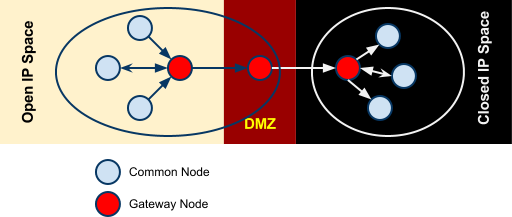

===================================================================================
Learning Registry Operations: Learning Registry Technical Specification V OP:0.50.1
===================================================================================

.. include:: ../stability.txt

See the `Change Log`_ for links to prior stable versions.

:changes:`Shading indicates major changes and additions from the prior version (0.24.0). Also indicated with ▲.`

:deletions:`Significant deletions are shaded.`

:deprecation:`Features to be deprecated in a future version are shaded and indicated with ▼.`

This document is part of one or more versions of the :doc:`Learning Registry Technical Specification <../Technical_Spec/index>`. It may contain links to other parts of the Specification.
These links may link to the most recent version of a part, not to the version of the part that corresponds to this version of this part.
Go to the appropriate version of the Specification that links to this version of this part, and follow the links there to the referenced part to find the version of the part that corresponds to this version of this part.

This document is part of the :doc:`Learning Registry Technical Specification <../Technical_Spec/index>`. It describes how to setup and operate a distribution network and community.

This document is not standalone.
The reader should be familiar with other parts of the specification, including, but not limited to:

- :doc:`General Matter <../General_Matter/index>`, including Licenses, Notation, Versioning, Glossary, References

- :doc:`Resource Distribution Network Model <../Resource_Distribution_Network_Model/index>`

- :doc:`Resource Data Data Models <../Resource_Data_Data_Model/index>`

- :doc:`Identity, Trust, Authentication, Security <../Identity_Trust_Auth_and_Security/index>`

- :doc:`Data Model and API Attributes and Behaviors <../Data_Model_and_API_Attributes_and_Behaviors/index>`

- :doc:`Services <../Services_and_APIs/index>` including :doc:`Distribution <../Distribution_Services/index>`, :doc:`Publish <../Publish_Services/index>`, :doc:`Access <../Access_Services/index>`, :doc:`Broker <../Broker_Services/index>`, :doc:`Management / Administration / Discovery <../Mgmt_Admin_and_Discovery_Services/index>`

In particular, the reader needs to be aware of the details of the :doc:`Resource Distribution Network Model <../Resource_Distribution_Network_Model/index>`.

----------
Operations
----------

This section outlines one approach of how to use the specified network model, data models and APIs to set up and operate a Learning Registry network community.

------------------------
Networks and Communities
------------------------

--------------------------------
Building the Network Description
--------------------------------

Node-specific information (i.e., description, filters, services and connectivity) SHALL be maintained on a per node basis.
Authorized document updates MAY be applied only at the node.
All node-specific information MAY be maintained in a node document collection per node.

Network-specific information (i.e., network description, network policy) SHALL be replicated on a per node basis.
The initial document MAY be stored at any node in the network.
Authorized document updates MAY be applied at any node in the network.
Replication, using the node’s connectivity information, MAY be used to propagate the documents throughout the network.
All network-specific information MAY be maintained in a network document collection per node.

Community-specific information (i.e., community description) SHALL be replicated on a per node basis.
The initial document MAY be stored at any node in the network.
Authorized document updates MAY be applied at any node in the community.
Replication, using the node’s connectivity information, MAY be used to propagate the documents throughout the network, including across network gateways between different communities.
All community-specific information MAY be maintained in a community document collection per node.

The overall network description MAY be inconsistent when publishing individual documents that describe the network.
When using document propagation, the node’s document collections MAY be out of sync, temporarily violating the requirement for identical values at all nodes.
Eventual consistency SHALL be enforced.
*NB*: Need to determine if lack of sync can introduce any security holes.

An implementation MAY place the node-specific information in one document database that is not replicated, network-specific information in a second database that is replicated throughout the network, and community-specific information in a third database that is replicated across the community.
Resource data is stored in another database that is replicated throughout the community using the defined connectivity.

Except for a optional local node storage used to maintain private state that is not replicated, other document databases SHALL NOT be defined for the purpose of holding node-specific, network-specific or community-specific information.

*Open Issue*:  As defined, gateways permit networks that allow documents to be replicated **into** the network from another network, but do not permit documents to be replicated **out** of the network (unless there is a corresponding bi-directional link).
With such a topology, community-specific information cannot reach all nodes if it is published to a node within a network with no outbound flow; the information will not reach other networks.
Possible solutions:

- publish the community-specific information to a node in each network that does not have outbound connectivity.

- define a distribution strategy (and possible extensions of node connectivity information) to allow bi-directional flow across network gateways or that limit flow based on document type.

- define node connections that provide only for distribution of network or community information, not resource data.

Likewise, gateways transmit documents across network boundaries.
They do not limit distribution to be within a single network.
Thus network-specific documents can cross network boundaries.
Possible solutions:

- define a distribution strategy that is limited to a network and not across gateways.

- define node connections that provide only for distribution of network information.

*NB*: The procedures described below are currently incomplete and do not implement any of these solutions.
They call for “network wide” (meaning network restricted) or “community wide” distribution.

*Open Question*: How to establish a security model so that only an authorized user may update a description at any node.
Is it necessary to sign the descriptions or to store a public key in a description?

*Open Question*: How to constrain the network so that if someone finds a connection, they cannot exploit it.

The network model MAY be instantiated in a set of procedures.
The procedures assume the *resource distribution network description* document, *resource distribution network policy* document and *network community description* document are published before the network is expanded from the base node.
If network expansion is done prior to these documents being created, appropriate *Distribution* processes SHALL be triggered after the documents are published to distribute them to all nodes in the network or community.

*NB*: The procedures only establish the network structure and descriptive documents.
They do not populate the network with resource data.
In particular, adding a new node to a network does not load resource data into the node’s resource data description document database.

*NB*: The procedure does not state what services need to be provisioned at a node.
Any organization can provision their own nodes, determine what services to offer (under what access constraints) and add the node to the network and community.
To participate in resource distribution, each source and target resource data distribution node SHALL provision the appropriate source or destination process of the :ref:`Resource Data Distribution Service <Resource Data Distribution Service>`.

The procedures include VALIDATE steps which are explicit semantic rules that need to be enforced, generally involving values in different documents.
The procedures also include REJECT steps.
These are general rules designed to check if a document is well formed, that all mandatory fields are present, that values are from constrained vocabularies, that immutable values are not changed on update, etc.
The procedure exits without changing the state of any database if validation fails (i.e., the procedure is a transaction).

Establish a Network Node
========================

    // Create one new node

    FIND a source for the node software, e.g., the Learning Registry `GitHub <http://www.google.com/url?q=https%3A%2F%2Fgithub.com%2FLearningRegistry%2FLearningRegistry&sa=D&sntz=1&usg=AFQjCNHAIkwLpeW5nAGVfizrLcIwxe21wg>`_

        // out of band process

    INSTALL the node software on a hardware node // physical or virtual

    CONFIGURE the node software 

    CREATE an identity for the node owner 

        // used to own node documents, proxy for document owner

    CREATE a *network node description* document for the node

    PUBLISH the *network node description* document to the new node by the node owner to the node’s *node document* database

        REJECT if the *network node description* document is not valid

        REJECT if a *network node description* document exists

    IF the node filters published or distributed data

        CREATE a *network node filter description* document for the node

        PUBLISH the *network node filter description* document to the new node by the node owner to the node’s *node document* database

            REJECT if the *network node filter description* document is not valid

            REJECT if a *network node filter description* document exists

    FOR EACH service that the node provides:

        CREATE a *network node service description* document for the service

        PUBLISH the *network node services description* document to the node by the node owner to the node’s *node document* database

        REJECT if the *network node service description* document is not valid

Establish a Resource Distribution Network
=========================================

    // Create a base, one-node network with a network description

    PREREQUISITE: one active node // denoted the base node 

        // via the *Establish a Node* process

    CREATE an identity for the network owner 

    CREATE a *resource distribution network description* document

    PUBLISH the *resource distribution network description* document to the first node 

        by the owner of the *resource distribution network description* document

        to the node’s *network document* database

        VALIDATE // same network

            network_id in the *network node description* document = network_id in the *resource distribution network description* document

        REJECT if the *resource distribution network description* document is not valid

        REJECT if a *resource distribution network description* document exists

    CREATE a *resource distribution network policy* document

    PUBLISH the *resource distribution network policy* document to the base node by the owner of the *resource distribution network policy* document to the node’s *network document* database

        VALIDATE // same network

            network_id in the *network node description* document = network_id in the *resource distribution network policy* document

        REJECT if the *resource distribution network policy* document is not valid

        REJECT if a *resource distribution network policy* document exists

Establish a Network Community
=============================

    // Create a base, one-network community with a network description

    PREREQUISITE: one active node // denoted the base node 

        // via the *Establish a Network Node* process

    PREREQUISITE: one active network

        // via the *Establish a Resource Distribution Network* process

    CREATE an identity for the network community owner

    CREATE a *network community description* document

    PUBLISH the *network community description* document to the base node by the owner of the network community to the node’s *network community document* database

        VALIDATE // same community in network and community descriptions

            community_id in the *resource distribution network description* document =

            community_id in the *network community description* document

        VALIDATE // same community in node and community descriptions

            community_id in the *network node description* document =

            community_id in the *network community description* document

        REJECT if the *network community description* document is not valid

        REJECT if a *network community description* document exists

Add a Network Node to a Resource Distribution Network
=====================================================

    // Add a node to an existing network

    // NB: Nothing in this process loads resource data into the node

    PREREQUISITE: an established active network // one or more active nodes

    PERFORM the *Establish a Network Node* process to create a node // denoted the new node

    FIND another active node in the network to connect to // denoted the existing node

        // discovery and agreement to connect is out of band

    PERFORM the *Adding Connections within a Resource Distribution Network* process

        source node is the existing node

        destination node is the new node

    PERFORM the *Distribution* process to replicate the *network document* database 

        from the source node to the destination node

        // propagates network description and policy to only the new node

        // may proceed asynchronously

Adding Connections within a Resource Distribution Network
=========================================================

    // Add connectivity between two existing nodes in a network

    // A source node connects to a destination node

    PREREQUISITE: an established network with two or more nodes

    PREREQUISITE: the active source node is known (connecting node)

    PREREQUISITE: the active destination node is known (connected node)

        // discovery and agreement to connect is out of band

    VALIDATE // same network

        network_id in the source node’s *network node description* document = network_id in the destination node’s *network node description* document

    VALIDATE // same community

        community_id in the source node’s *network node description* document = community_id in the destination node’s *network node description* document

    CREATE a *network node connectivity description* document with

        source_node_url := source node URL

        destination_node_url := destination node URL

        gateway_connection := F

    PUBLISH the *network node connectivity description* document

        by the source node owner

        to the source node’s *node document* database

    REJECT if the *network node connectivity description* document is not VALID

    REJECT if the same source -> destination active connection exists

Connect Networks within a Community
===================================

    // Add a gateway connection between two networks

    // NB: Nothing in this process distributes resource data across the gateway

    PREREQUISITE: two established networks

    PREREQUISITE: the active source node is known (connecting node)

    PREREQUISITE: the active destination node is known (connected node)

        // discovery and agreement to connect is out of band

    VALIDATE // different network

        network_id in the source node’s *network node description* document <> network_id in the destination node’s *network node description* document

    VALIDATE // same community

        community_id in the source node’s *network node description* document = community_id in the destination node’s *network node description* document

    VALIDATE // no gateway

        FOR EACH source node’s *network node connectivity description* document

            NOT gateway_connection

    CREATE a *network node connectivity description* document with

        source_node_url := source node URL

        destination_node_url := destination node URL

        gateway_connection := T

    PUBLISH the *network node connectivity description* document by the source node owner to the source node’s *node document* database

    REJECT if the *network node connectivity description* document is not VALID

    REJECT if the same source -> destination active connection exists

Connect Communities
===================

    // Add a gateway connection between two communities

    // NB: Nothing in this process distributes resource data across the gateway

    PREREQUISITE: two communities networks

    PREREQUISITE: the active source node is known (connecting node)

    PREREQUISITE: the active destination node is known (connected node)

        // discovery and agreement to connect is out of band

    VALIDATE // social communities

        social_community T in the source node’s *network community description* document

        social_community T in the destination node’s *network community description* document

    VALIDATE // different network

        network_id in the source node’s *network node description* document <> network_id in the destination node’s *network node description* document

    VALIDATE / different community

        community_id in the source node’s *network node description* document <> community_id in the destination node’s *network node description* document

    VALIDATE // no gateway

        FOR EACH source node’s *network node connectivity description* document

            NOT gateway_connection

    CREATE a *network node connectivity description* document with

        source_node_url := source node URL

        destination_node_url := destination node URL

        gateway_connection := T

    PUBLISH the *network node connectivity description* document

        by the source node owner

        to the source node’s *node document* database

    REJECT if the *network node connectivity description* document is not VALID

    REJECT if the same source -> destination active connection exists

------------------------------------
Maintaining Networks and Communities
------------------------------------

An established network or community MAY be maintained by updating descriptions of network nodes, their services, their connectivity, descriptions of resource distribution networks and of network communities.
By definition, elements of the network model SHALL NOT be deleted; they are transitioned from active to not active.
*NB**:* The data models contain forward links to other models.
Deleting a document would require network-level garbage collection to determine when all links to a document have been deleted.

If updating the description of a network node, its services or connectivity, the description of a the distribution network or the network community causes the descriptions to violate the requirements for the :ref:`Network Description <Network Description>`, the node SHALL NOT be considered to be a part of the corresponding distribution network and network community and SHALL NOT participate in any network or resource operations.

Change Network Node Description
===============================

    // update the description of any node

    PUBLISH the updated *network node description* document to the node 

        by the node owner 

        to the node’s *node document* database

        REJECT if the *network node description* document is not valid

        REJECT if the *network node description* document is not an update

        // node may have only one network node description

Delete a Network Node
=====================

    // remove a node from a network

    // but the node remains, inaccessible

    // first sync the documents so that others have them

    // sync before delete is an operational policy choice; could be modeled in policy

    COMMIT all outstanding resource data description database operations

    PERFORM the Distribute Resource process 

    FOR EACH *resource data description* document

        delete the document from the node’s *resource data description document database*

        // this is an explicit delete

    PUBLISH the updated *network node description* document to the node by the node owner

        ACTIVE = F

        to the node’s *node document* database

        REJECT if the *network node description* document is not valid

        REJECT if the *network node description* document is not an update

         // node may have only one network node description

    FOR EACH *network node services description* document

        PERFORM the Delete Node Service process

    FOR EACH *network node connectivity description* document

        PERFORM the Delete Node Network Connection process

Change Node Service Description
===============================

    // update the description of a service at any node

    PUBLISH the updated *network node services description* document to the node 

        by the node owner 

        to the node’s *node document* database

    REJECT if the *network node service description* document is not valid

    REJECT if the *network node service description* document is not an update

Add Node Service
================

    // add a service to any node

    PUBLISH the new *network node services description* document to the node 

        by the node owner 

        to the node’s *node document* database

    REJECT if the *network node service description* document is not valid

    REJECT if the *network node service description* document is not an addition

Delete Node Service
===================

    // delete a service from any node

    PUBLISH the updated *network node services description* document to the node

        ACTIVE = F

        by the node owner

        to the node’s *node document* database

    REJECT if the *network node service description* document is not valid

    REJECT if the *network node service description* document is not an update

Change Node Network Connectivity
================================

    // change the connectivity description of a connection from a node

    // unless there are mutable extension data elements, the process is a NO-OP

    // all other data elements are immutable

    PUBLISH the updated *network node connectivity description* document 

        by the source node owner 

        to the source node’s *node document* database

    REJECT if the *network node connectivity description* document is not valid

    REJECT if the *network node connectivity description* document is not an update

Delete Node Network Connectivity
================================

    // remove the connection from a node to another node

    // applies to intra-network or inter-network or inter-community

    PUBLISH the updated *network node connectivity description* document

        ACTIVE = F

        by the source node owner

        to the source node’s *node document* database

    REJECT if the *network node connectivity description* document is not valid

    REJECT if the *network node connectivity description* document is not an update

Change Node Filters
===================

    // change the filters at a node

    PUBLISH the updated *network node filter description* document 

        by the source node owner 

        to the source node’s *node document* database

    REJECT if the *network node filter description* document is not valid

    REJECT if the *network node filter description* document is not an update

Delete Node Filters
===================

    // delete ALL filters at a node

    PUBLISH the updated *network node filter description* document

        ACTIVE = F

        by the source node owner

        to the source node’s *node document* database

    REJECT if the *network node filter description* document is not valid

    REJECT if the *network node filter description* document is not an update

Change Resource Distribution Network Description
================================================

    // change the resource distribution network description

    // applied at some node

    PUBLISH the updated *resource distribution network description* document 

        by the *resource distribution network description* document owner 

        to the node’s *network document* database

    REJECT if the *resource distribution network description* document is not valid

    REJECT if the *resource distribution network description* document is not an update

    PERFORM a network-wide *Distribution* process to replicate the *network document* database 

        to the other nodes in the network

        // propagates resource distribution network description to all nodes in the network

        // may proceed asynchronously

Delete Resource Distribution Network Description
================================================

    // delete the resource distribution network description

    // applied at some node

    PUBLISH the updated *resource distribution network description* document

        ACTIVE = F

        by the *resource distribution network description* document owner

        to the node’s *network document* database

    REJECT if the *resource distribution network description* document is not valid

    REJECT if the *resource distribution network description* document is not an update

    PERFORM a network-wide *Distribution* process to replicate the *network document* database 

        to the other nodes in the network

        // propagates resource distribution network description to all nodes in the network

        // may proceed asynchronously

Change Resource Distribution Network Policy
===========================================

    // change the resource distribution network policy

    // applied at some node

    PUBLISH the updated *resource distribution network policy* document 

        by the *resource distribution network policy* document owner 

        to the node’s *network document* database

    REJECT if the *resource distribution network policy* document is not valid

    REJECT if the *resource distribution network policy* document is not an update

    PERFORM a network-wide *Distribution* process to replicate the *network document* database 

        to the other nodes in the network

        // propagates resource distribution network policy to all nodes in the network

        // may proceed asynchronously

Delete Resource Distribution Network Policy
===========================================

    // delete the resource distribution network policy

    // applied at some node

    PUBLISH the updated *resource distribution network policy* document

        ACTIVE = F

        by the *resource distribution network policy* document owner

        to the node’s *network document* database

    REJECT if the *resource distribution network policy* document is not valid

    REJECT if the *resource distribution network policy* document is not an update

    PERFORM a network-wide *Distribution* process to replicate the *network document* database 

        to the other nodes in the network

        // propagates resource distribution network policy to all nodes in the network

        // may proceed asynchronously

Change Network Community Description
====================================

    // change the network community description

    // applied at some node in some network in the community

    // node must have connectivity to reach all other networks

    // otherwise apply to multiple nodes

    PUBLISH the updated *network community description* document 

        by the *network community description* document owner 

        to the node’s *network community document* database

    REJECT if the *network community description* document is not valid

    REJECT if the *network community description* document is not an update

    PERFORM a community-wide *Distribution* process to replicate the *community document* database 

        to the other nodes in the community

        // propagates community description to all nodes in the community

        // may proceed asynchronously

Delete Network Community Description
====================================

    // delete the network community description

    // applied at some node in some network in the community

    // node must have connectivity to reach all other networks

    // otherwise apply to multiple nodes

    PUBLISH the updated *network community description* document

        ACTIVE = F

        by the *network community description* document owner

        to the node’s *network community document* database

    REJECT if the *network community description* document is not valid

    REJECT if the *network community description* document is not an update

    PERFORM a community-wide *Distribution* process to replicate the *community document* database 

        to the other nodes in the community

        // propagates community description to all nodes in the communities

        // may proceed asynchronously

.. _Network Discovery:

Network Discovery
=================

Finding all the nodes in a network or community is a non core service.
One approach is to use replication and distribution to build a complete list of all network links at each node (an alternative is to traverse the network and build the link structure).
Given a database of node-specific documents that includes a node’s connectivity that is not replicated (private to the node), and a second duplicate database that is replicated across the entire network or community, first replicate the connectivity document from the private node database to the network or community database stored at the node.
This replication is done at each node in the network.
It is a one-way replication from the private node database to the second database, not a full synchronization.
Then distribute (synchronize) the second database across all nodes.
Distribution (synchronization) across nodes of the network or community database will build a network connectivity link table at each node.

The completeness of the table in showing the entire network or part of the network will depend on the connectivity and gateways, i.e., the connectivity of a network will not be propagated to nodes outside the network unless there is a directional gateway.
The tables of networks or communities with only inbound connectivity will include the entries of the external networks.

*NB*: This process only builds the network link table at a point in time.
It does not provide real-time connectivity status.

--------------
Network Design
--------------

Any resource distribution network is technically open; any node MAY connect.
Managing connectivity and details of the topology and operations of any specific resource distribution network (and its connection to other resource distribution networks and network communities) SHALL be determined by the governance and policy rules of a resource distribution network or network node, not via this specification.

Multiple resource distribution networks and network communities MAY be established and connected.
In addition to external governance and policies, this specification imposes restrictions on connections between network communities and resource distribution networks, i.e., 1:1 connections only using gateway nodes.
Because of the technical burden imposed, multiple resource distribution networks and network communities SHOULD only be created when these specification-imposed criteria are needed to enable additional security and technical criteria that cannot be adequately satisfied by policy alone.

For example, connecting an open community in an open IP space to a more restricted community might involve establishing a gateway node in the open community in a public IP space, providing a gateway node in for the restricted community in a DMZ, opening limited network ports between the DMZ and the other nodes in restricted community that operate within a closed IP space (possibly using an additional gateway), and locking down the connections between the open community and the DMZ gateway node.
The illustration shows an example of such a gateway structure.

|picture_0|

--------------------------------------------------
Resource Data Publication, Distribution and Access
--------------------------------------------------

Once a resource distribution network has been established, external agents use the publish services at network nodes to publish or update resource data to nodes in the resource distribution network.
Network nodes SHALL store the valid, published resource data in their resource data description documents database.
Publication MAY be performed via any of the :ref:`Resource Data Publish Services <Resource Data Publish Services>`, value-added services or via tools and applications that are built upon these services.
Other mechanisms to publish resource data (e.g., direct access to the underlying data stores) SHALL NOT be supported.

Publication SHALL reject any resource data that is tagged as not distributable.

Publication SHALL satisfy trust and identity conditions.
The same resource data may be published to one or more nodes in one or more resource distribution networks subject to their policies and the trust and identity conditions.

Publication SHALL satisfy network node filters.
Only resource data that passes the filters (if they exist) SHALL be published.
Filters are optional.

Publication SHALL add or update any node-specific data.

In distribution, destination nodes SHALL reject any resource data that is tagged as not distributable.

In distribution, destination nodes SHALL filter all incoming resource data.
Only resource data that passes the filters (if they exist) SHALL be persisted.
Filters are optional.

Distribution SHALL add or update any node-specific data.

Resource distribution network nodes distribute their data to other nodes.
If a network node provides the resource data distribution service, it SHALL periodically launch the :ref:`Resource Data Distribution Service <Resource Data Distribution Service>` service to distribute resource data from the node to its connected nodes.
Any node that wants to establish a connection with another node, i.e., wants to be the target of distribution, SHALL support the necessary services that allow the source node to distribute data to it.

Resource data is available for access by external agents through the access services at network nodes.
Access MAY be provided via any of the supplied :ref:`Resource Data Access Services <Resource Data Access Services>`, value-added services or via tools and applications that are built using these services.
Other mechanisms to access resource data (e.g., direct access to the underlying data stores) SHALL NOT be supported.

Access SHALL satisfy trust and identity conditions.
When available via distribution, the same resource data may be accessed from one or more nodes in one or more resource distribution networks, subject to their policies and the trust and identity conditions.

There is no requirement to block access to resource data that is tagged as non distributatble.

Resource distribution network nodes MAY provide :ref:`Broker Services <Broker Services>`. Operation of a broker service SHALL be determined by the governance and policy rules of a resource distribution network or network node, not via this specification.

Service provisioning (publish, access, distribution, broker) SHALL be determined by the governance and policy rules of a resource distribution network or network node, not via this specification.

.. _Resource Data Persistence:

Resource Data Persistence
=========================

A node SHALL persist resource data stored at a node for at least as many days as specified by the TTL (time to live) in the resource distribution network policy description.
A node MAY “delete” documents that have been stored longer than the network’s TTL.

If the node supports harvest, the node SHALL maintain a value for earliestDatestamp.
This value is the oldest publish, update or delete time for a resource data description document that can be accessed at the node via harvest.
The timestamp SHALL be precise to the nearest second.
The value is based on the time the resource data description documents are published at the node `(▲node_timestamp).`:changes:

Access to information about the deletion of resource data is governed by a node-specific policy, deleted_data_policy:

- no -- the node SHALL not *expose* any data about deleted resource data description documents.
  The node MAY maintain information about deletions.

- persistent -- the node SHALL maintain and expose data about deleted resource data description documents.
  Information about deleted resource data SHALL be persisted as long as the node remains active, i.e., information about deletion is not governed by the TTL.

- transient -- the node MAY maintain and expose data about deleted resource data description documents.
  The node MAY establish any policy for how long or if it maintains and exposes data about deleted resource data description documents.

*NB*: This is the information about the deletion, not the actual deletion.
What it means to “delete” a document is not specified, e.g., it is removed or just marked as deleted.
Tracking of deletions MAY be independent of the actual TTL and the actual deletion of the resource data.

*Open Question*: Should the data persistence policies be network, not node, specific.

*Open Issue*: Using pure replication, when one node deletes a document, the delete will propagate.
This MAY invalidate the required information about the tracking and persistence of deletions.
What is the model for deletion versus TTL and access to deletion status for harvest?

----------------------
Network Administration
----------------------

Resource distribution network nodes MAY provide :ref:`Administrative Services <Administrative Services>`. Operation of an administrative service SHALL be determined by the governance and policy rules of a resource distribution network or network node, not via this specification.

Provisioning of administrative services SHALL be determined by the governance and policy rules of a resource distribution network or network node, not via this specification.

*Open Question*: Do we need a mechanism to control access to network data models beyond authentication controls?

----------
Change Log
----------

*NB*: The change log only lists major updates to the specification.

*NB*: Updates and edits may not results in a version update.

*NB*: See the :doc:`Learning Registry Technical Specification <../Technical_Spec/index>` for prior change history not listed below.

+-------------+----------+------------+----------------------------------------------------------------------------------------------------------------------------------------------------------------------------------------------------------------------------------------------------------------------------------------------+
| **Version** | **Date** | **Author** | **Change**                                                                                                                                                                                                                                                                                   |
+-------------+----------+------------+----------------------------------------------------------------------------------------------------------------------------------------------------------------------------------------------------------------------------------------------------------------------------------------------+
|             | 20110921 | DR         | This document extracted from the monolithic V 0.24.0 document. `Archived copy (V 0.24.0) <https://docs.google.com/document/d/1Yi9QEBztGRzLrFNmFiphfIa5EF9pbV5B6i9Tk4XQEXs/edit?hl=en_US>`_                                                                                                   |
+-------------+----------+------------+----------------------------------------------------------------------------------------------------------------------------------------------------------------------------------------------------------------------------------------------------------------------------------------------+
| 0.49.0      | 20110927 | DR         | Editorial updates to create stand alone version.Archived copy location TBD. (V OP:0.49.0)                                                                                                                                                                                                    |
+-------------+----------+------------+----------------------------------------------------------------------------------------------------------------------------------------------------------------------------------------------------------------------------------------------------------------------------------------------+
| 0.50.0      | TBD      | DR         | Renumber all document models and service documents.Archived copy location TBD. (V OP:0.50.0)                                                                                                                                                                                                 |
+-------------+----------+------------+----------------------------------------------------------------------------------------------------------------------------------------------------------------------------------------------------------------------------------------------------------------------------------------------+
| Future      | TBD      |            | Archived copy location TBD. (V OP:x.xx.x)                                                                                                                                                                                                                                                    |
+-------------+----------+------------+----------------------------------------------------------------------------------------------------------------------------------------------------------------------------------------------------------------------------------------------------------------------------------------------+
| 0.50.1      | 20130312 | JK         | This document extracted from original Google Doc and converted to RestructuredText. `Archived copy (V OP:0.50.0) <https://docs.google.com/document/d/1NxS_QSxuTemFOi0uduUDvX69m8_AwHPUM2HmnI-tyuc/edit>`_                                                                                    |
|             |          |            | node_timestamp removed from deprecation.                                                                                                                                                                                                                                                     |
+-------------+----------+------------+----------------------------------------------------------------------------------------------------------------------------------------------------------------------------------------------------------------------------------------------------------------------------------------------+

----------------------------------
Working Notes and Placeholder Text
----------------------------------

.. role:: deprecation

.. role:: deletions

.. role:: changes
