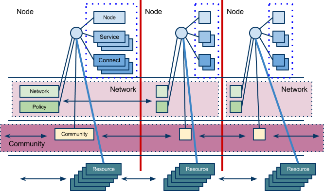
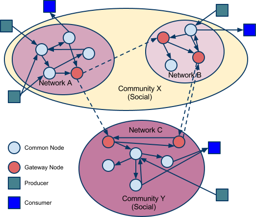

==========================================================================================
Resource Distribution Network Model: Learning Registry Technical Specification V NM:0.50.1
==========================================================================================

.. include:: ../stability.txt

See the `Change Log`_ for links to prior stable versions.

:changes:`Shading indicates major changes and additions from the prior version (0.24.0). Also indicated with ▲.`

:deletions:`Significant deletions are shaded.`

:deprecation:`Features to be deprecated in a future version are shaded and indicated with ▼.`

This document is part of one or more versions of the :doc:`Learning Registry Technical Specification <../Technical_Spec/index>`. It may contain links to other parts of the Specification.
These links may link to the most recent version of a part, not to the version of the part that corresponds to this version of this part.
Go to the appropriate version of the Specification that links to this version of this part, and follow the links there to the referenced part to find the version of the part that corresponds to this version of this part.

This document is part of the :doc:`Learning Registry Technical Specification <../Technical_Spec/index>`. It describes the model of resource data that is transported through the network.

This document is not standalone.
The reader should be familiar with other parts of the specification, including, but not limited to:

- :doc:`General Matter <../General_Matter/index>`, including Licenses, Notation, Versioning, Glossary, References

- :doc:`Resource Distribution Network Model <../Resource_Distribution_Network_Model/index>`

- :doc:`Identity, Trust, Authentication, Security <../Identity_Trust_Auth_and_Security/index>`

- :doc:`Data Model and API Attributes and Behaviors <../Data_Model_and_API_Attributes_and_Behaviors/index>`

- :doc:`Services <../Services_and_APIs/index>` including :doc:`Distribution <../Distribution_Services/index>`, :doc:`Publish <../Publish_Services/index>`, :doc:`Access <../Access_Services/index>`, :doc:`Broker <../Broker_Services/index>`, :doc:`Management <../Mgmt_Admin_and_Discovery_Services/index>`/:doc:`Administration <../Mgmt_Admin_and_Discovery_Services/index>`/:doc:`Discovery <../Mgmt_Admin_and_Discovery_Services/index>`

- :doc:`Learning <../Operations/index>` :doc:`Registry <../Operations/index>` :doc:`Operations <../Operations/index>`

In particular, the reader needs to be aware that specific criteria for the Network Model are presented in the :doc:`Data Model and API Attributes and Behaviors <../Data_Model_and_API_Attributes_and_Behaviors/index>` part.

.. _Resource Distribution Network Model:

-----------------------------------
Resource Distribution Network Model
-----------------------------------

The core of the Learning Registry is the network of loosely connected master-master synchronizing broker nodes distributing resources, metadata and paradata.
Consumers and producers (edge node consumer and producer agents) connect to network nodes to inject information into the network or to extract information for external processing.

The network model is defined in terms of nodes, their services, the assembly of nodes into resource distribution networks, and the structuring of networks into communities.
This two-tiered model of networks and communities supports security requirements for partitioning of resource data between different communities.

Network Nodes and Node Services
===============================

A **node** is a server process with network connectivity to either other nodes or to edge services.
Nodes process **resource** **data** (e.g., network messages about resources, metadata, paradata, etc.).

A node SHALL be described using the :ref:`network<Network Node Description Data Model>` :ref:`node<Network Node Description Data Model>` :ref:`data<Network Node Description Data Model>` :ref:`model<Network Node Description Data Model>`.
Only the owner of a node description MAY change the description.
Certain attributes of the node description are immutable.
*NB*: These are security constraints.

A node MAY provide five (5) different classes of services (:ref:`Services and APIs and Resource Data Data Models <Resource Data Data Models>` are described in their respective parts of the specification:

- **Publish** **Services**: :ref:`Resource Data Publish Services <Resource Data Publish Services>`  are used by external agents to push (publish) resource data from the external agent into the distribution network.
  The data model for publication data is specified below.
  A node that provides publish services MAY support different publishing APIs, but all SHALL use the publication data model.
  

- **Access** **Services**: :ref:`Resource Data Access Services <Resource Data Access Services>` are used by external agents to discover, access and obtain (pull) resource data from the distribution network.
  A node that provides access services MAY support different access APIs.
  

- **Distribution** **Services**: The :ref:`Resource Data Distribution Service <Resource Data Distribution Service>` is used to transfer, replicate and synchronize resource data from node X to node Y. X is the source node for distribution, Y is the destination node.
  To support security requirements, distribution is directed from X to Y; independent paired services [X→Y + Y→X] are used for bi-directional synchronization.
  

- **Broker** **Services**: :ref:`Broker Services <Broker Services>` operate at a node to augment, transform or process resource data held at that node to produce new or updated resource data for access or distribution.
  A node that provides broker services MAY support different broker processes.

- **Administrative** **Services**: :ref:`Administrative Services <Administrative Services>` are used to query a node to obtain its status or to trigger node administrative actions.
  

*NB*: There are no requirements to provision any service at a node.
Provisioning requirements MAY be established by the policies of a particular network or community.
This specification permits non operational or non accessible networks.

Network Topology
================

A **resource** **distribution** **network** is a group of one or more connected nodes, with each node providing node services.
All nodes in a resource distribution network operate under the same policies.
Multiple resource distribution networks MAY be established.

A resource distribution network SHALL be described using the :ref:`Resource Distribution Network Model <Resource Distribution Network Model>`. Only the owner of a network description MAY change the description.
Certain attributes of the resource distribution network description are immutable.
*NB*: These are security constraints.

Two types of network nodes and connectivity within a network are defined:

- **Common** **Node**: A common node MAY provide any of the node service classes listed.
  If provided, the distribution services of a common node SHALL be limited to connecting to other nodes in the same network (the distribution service MAY connect to multiple destination nodes).
  A common node is denoted CN herein.

- **Gateway** **Node**: A gateway node SHALL provide a distribution service.
  A gateway node MAY connect to one or more common nodes within the same network.
  A gateway node SHALL connect to and provide resource distribution to a gateway node in another network.
  A gateway node MAY provide administrative services.
  A gateway node SHALL NOT provide publish, access or broker services.
  A gateway node is denoted GN herein.
  *NB*: As defined, a gateway is a 1:1 interconnect between two networks.
  1:1 is used to simplify topology in support of security requirements; it is not a technical constraint.
  *NB*: Multiple gateway nodes between two networks are permitted.

A node SHALL participate in, and be subject to the policies of, only one resource distribution network.

A node SHALL not transition or be moved from one resource distribution network to another.
A node MAY only be added to or removed from a distribution network.
*NB*: This is a security constraint.

A gateway node X that participates in some network N1 SHALL connect to a gateway node Y that participates in some other network N2. A gateway node SHALL NOT connect to any other nodes in network N2 or to any node in any other network.

*Open* *Question*: Relax the constraint that a gateway cannot connect to multiple networks while keeping the constraint that it connects to only 1 node in another network?

A **network** **community** is a collection of interconnected resource distribution networks.
A community MAY contain one or more resource distribution networks.
A resource network SHALL be a member of only one community.
Gateway nodes provide the connectivity between resources networks within a network community and MAY provide connectivity between networks in different communities.
*NB*: A gateway node that provides an intra-community network gateway is undifferentiated from one that provides an inter-community network gateway.

A network community SHALL be described using the :ref:`Network Community Description Data Model <Network Community Description Data Model>`. Only the owner of a network community description MAY change the description.
Certain attributes of the network community description are immutable.
*NB*: These are security constraints.

Two types of network communities are defined:

- **Social** **Community**: A social community provides connectivity to other social communities.
  A network within a social community MAY connect to another network within the same social community or with a network that belongs to a different social community.

- **Closed** **Community**: A closed community provides no connectivity outside of the community.
  A network within a closed community SHALL NOT connect with another network within a different community.

For example, the Learning Registry is a social community; other social communities may connect to the Learning Registry community.
For security and testing, the Learning Registry Testbed is a closed community, i.e., it consists of different networks (multiple networks to enable testing gateway protocols) but the testbed cannot be connected to the social production community.

The Learning Registry community might consist of multiple networks and gateways.
One network might be for uncurated OERs (open educational resources).
A second network might be for curated OERs.
And several others networks could be established for commercial resources (e.g., one per publisher).
If the uncurated OER network has a gateway to the curated OER network, and there are gateways to each commercial networks, resource data can flow in only one direction, e.g., resource data for OERs into the commercial networks, but not the reverse.

A network SHALL not transition or be moved from one network community to another.
A network MAY only be added to or removed from a network community.
*NB*: This is a security constraint.

The resource network model provides nodes, collections of connected nodes within a network and the interconnection of networks in communities.
The network model has this fixed hierarchy of components.
Network communities connect to other communities using the same mechanism as networks that connect within a community.

Other network topology restrictions MAY be established by the policies of a particular network or community.
This specification is intentionally minimal and does not define or limit other topologies, including degenerate topologies.
*NB*: The model lets one design a network topology that might violate the policy and security constraints of a participating organization.

The diagram illustrates the network model.
In the diagram there are three resource distribution networks (A, B, C) and two network communities (X and Y).
Resource distribution network A connects to network B; both are part of the same community.
Resource distribution network A also connects to network C and network C connects to network B. Resource distribution network C is in a different network community from A and B. If either network community X or Y was a closed community, the inter-network connection would not be permitted.

|picture_0|

.. _Network Data Models:

Network Data Models
===================

The description of a network is maintained in a set of documents that includes:

- Network Node documents:

  - The description of the node.

  - The description of the connectivity of the node within the network (including gateways).

  - The description of the services provided by the node.

  - The description of the filters applied at a node.

- Resource Distribution Network documents:

  - The description of the resource distribution network that the node is a part of.

  - The description of the policies that govern the resource distribution network.

- Network Community documents:

  - The description of the network community that the node is a part of.

All data models MAY be extended with additional elements.
The name of any extension element SHALL begin with the characters "X\_" designating an extension element.
Any document that includes any element that is not in the defined data model or is not an extension element is non conforming and SHALL be rejected by any service.

All data models have a named attribute that is a “type” element (doc_type).
The data model description specifies the literal value for this element for all instances of each type of document.

All data models have a named attribute that is a “version” element (doc_version).
The data model description specifies the literal value for this element for all document instances.

All data models have a named attribute that indicates if the document instance is in use (active).
Network data model document instances are never deleted; they transition from active to not active.

Additional constraints on attributes values are detailed in :ref:`Data Model Attributes <Data Model Attributes>`.

.. _Network Node Description Data Model:

Network Node Description Data Model
-----------------------------------

The data model describing a node document.
Once the data model has been instantiated for a node, the value of an immutable element SHALL NOT change.
Other values MAY be changed only by the owner of the node document.

::

    {

      "doc_type": "node_description",
                                                                  // the literal "node_description"
                                                                  // required, immutable

      "doc_version": "0.23.0",
                                                                  // the literal for the current version -- "0.23.0"
                                                                  // required, immutable

      "doc_scope": "node",
                                                                  // the literal "node"
                                                                  // required, immutable

      "active": boolean,
                                                                  // is the network node active
                                                                  // required, mutable from T to F only

      "node_id": "string",
                                                                  // id of the node, required
                                                                  // unique within scope of the LR
                                                                  // immutable

      "node_name": "string",
                                                                  // name of the node, optional

      "node_description": "string",
                                                                  // description of the node, optional

      "node_admin_identity": "string",
                                                                  // identity of node admin, optional

      "network_id": "string",
                                                                  // id of the network that this node is a part of 
                                                                  // recommended (required for gateway distribution)
                                                                  // immutable

      "community_id": "string",
                                                                  // id of the community that this node is a part of
                                                                  // recommended (required for gateway distribution)
                                                                  // immutable

      "gateway_node": boolean,
                                                                  // T if node is a gateway node
                                                                  // recommended, F if not present, immutable

      "open_connect_source": boolean,
                                                                  // T if node is willing to be the source to
                                                                  // connect to any other node
                                                                  // F if node connectivity is restricted
                                                                  // recommended; F if not present

      "open_connect_dest": boolean,
                                                                  // T if node is willing to be the destination
                                                                  // to connect to any other node
                                                                  // F if node connectivity is restricted
                                                                  // recommended; F if not present

      // node-specific policies, optional
      "node_policy":  
      {

        "sync_frequency": integer,
                                                                  // target time between synchronizations in minutes
                                                                  // optional
        "deleted_data_policy": "string",
                                                                  // fixed vocabulary ["no", "persistent", "transient"]
                                                                  // see :ref:`Resource Data Persistence <Resource Data Persistence>`

        "TTL": integer,
                                                                  // minimum time to live for resource data in the node
                                                                  // in days, optional
                                                                  // overrides network policy TTL is larger than network TTL

        "accepted_version": ["string"],
                                                                  // list of resource data description document versions
                                                                  // that the node can process, optional

        "accepted_TOS": ["string"],
                                                                  // list of ToS that the node will accept, optional
        "accepts_anon": boolean,
                                                                  // T if node is willing to take anonymous submissions
                                                                  // F if all submissions must be identified
                                                                  // optional, T if not present

        "accepts_unsigned": boolean,
                                                                  // T if node is willing to take unsigned submissions
                                                                  // F if all data must be signed
                                                                  // optional, T if not present

        "validates_signature": boolean,
                                                                  // T if node will validate signatures
                                                                  // F if node does not validate signatures
                                                                  // optional, F if not present

        "check_trust": boolean,
                                                                  // T if node will evaluate trust of submitter
                                                                  // F if node does not check trust
                                                                  // optional, F if not present

        "max_doc_size": integer 
                                                                  // maximum size of a document that a node will store
                                                                  // in bytes
                                                                  // optional, if not present behavior is not defined
      },

      "node_key": "string",
                                                                  // node public key, optional
      "X_xxx": ? ? ? ? ? // placeholder for extensibility, optional
    }

*NB*: The node admin identity SHOULD be a URL, e.g., an email address.
A deployment MAY specify that the identity be used to look up the node’s public key in a key server.

*NB*: Synchronization/replication frequency is maintained on a per node basis.
This allows each node to sync on a different frequency (versus a network wide sync frequency), but does not allow each connection to a node to sync on a different frequency, which might complicate scheduling.

*NB*: The deleted data policy is used to support OAI-PMH harvest.
It is part of the node description and not the service description since it controls overall node behavior and data persistence.

*NB*: The node MAY advertise its public key in the data model instance versus requiring key server lookup.

*NB*: The node MAY advertise its TTL.
The value SHALL be ignored if it is smaller than the network policy TTL.

*NB*: The node MAY advertise the ToS that it will accept.

*NB*: If the node does not specify the versions of resource data description document that it accepts, it MUST accept all versions (current and future).

*NB*: A node MAY advertise that it does not accept anonymous submissions, e.g., resource data description documents where the submitter_type is anonymous.
By default, anonymous submissions are supported.

*NB*: A node MAY advertise that it does not accept unsigned submissions.
By default, submissions need not be signed.

*NB*: A node MAY advertise that it validates signatures.
By default, all signatures are not validated.

*NB*: A node MAY advertise that it determines trust of submitter.
By default, all trust is not checked.

*NB*: Signing, trust, etc., are all OPTIONAL.
Default policy values imply that the node has a weak security and trust model.
A node MUST explicitly state the policies it enforces.

*Open* *Question*: Should there be a short cut notation for ranges of accepted document versions?

*Open* *Question*: Have a list of accepted document versions, or just make this a filter?

.. _Network Node Service Description Data Model:

Network Node Service Description Data Model
-------------------------------------------

The data model describing a service description document; one document per service available at a node.
Once the data model has been instantiated for a service, the value of an immutable element SHALL NOT change.
Other values MAY be changed only by the owner of the node document.

*NB*: Ownership and control of the node description document and of the node service description document are vested in the same identity.

::

    {

        "doc_type": "service_description",
                                                      // the literal "node_description"
                                                      // required, immutable

        "doc_version": "0.20.0",
                                                      // the literal for the current version -- "0.20.0"
                                                      // required, immutable

        "doc_scope": "node",
                                                      // the literal "node"
                                                      // required, immutable

        "active": boolean,
                                                      // is the service active
                                                      // required, mutable from T to F only

        "service_id": "string",
                                                      // id of the service, required
                                                      // unique within scope of the LR
                                                      // immutable

        "service_type": "string",
                                                      // fixed vocabulary ["publish", "access", 
                                                      // "distribute", "broker", "administrative"]
                                                      // required, immutable

        "service_name": "string",
                                                      // name of the service, optional

        "service_description": "string",
                                                      // description of the service, optional

        "service_version": "string",
                                                      // version number of the service description, required
                                                      // version is local to the Learning Registry
                                                      // not the version of some underlying spec for the service

        "service_endpoint": "string",
                                                      // URL of service, required

        // service authentication and authorization descriptions                                              
        "service_auth": 
        {

            "service_authz": ["string"],
                                                        // fixed vocabulary
                                                        // ["none", "basicauth", "oauth", "ssh", ...]
                                                        // required, mutable from "none" to any stronger auth

            "service_key": boolean,
                                                        // is a service key required to use the service
                                                        // optional, immutable, default F

            "service_https": boolean 
                                                        // does service require https
                                                        // optional, immutable, default F
        },

        // service-specific key-value pairs, optional
        "service_data": { 
            < key - value pairs >
        },

        "X_xxx": ? ? ? ? ?                            
                                                      // placeholder for extensibility, optional
    }

*NB*: A service description document is required for each service.
Services SHALL fail if they do not find a valid, active, service description document.

*NB*: Whenever a service is modified (e.g., added capabilities, support for different data formats, API changes, …), a new service description document with an updated version number SHOULD be published.
The service version and service description document version SHOULD be synchronized.

*NB*: The service description document enables both automatic discovery of services and management of service configuration data that is needed by clients.

*NB*: When the service is deployed at a node, appropriate values for the placeholders (e.g., service_id, service_endpoint, service_auth) SHALL be provided.
Appropriate values for the service_data elements SHALL be provided if required for the service.
If no service data is required, the service_data element SHOULD be omitted.
The descriptive values (service_name, service_description) MAY be changed from what is specified herein.

.. _Network Node Connectivity Description Data Model:

Network Node Connectivity Description Data Model
------------------------------------------------

The data model describing a node connectivity document; one document per connection at a node.
Once the data model has been instantiated for a connection, the value of an immutable element SHALL NOT change.
Other values MAY be changed only by the owner of the node document.

*NB*: Ownership and control of the node description document and of the node connectivity description document are vested in the same identity.

::

    {

        "doc_type": "connection_description",
                                                    // the literal "connection_description"
                                                    // required, immutable

        "doc_version": "0.10.0",
                                                    // the literal for the current version -- "0.10.0"
                                                    // required, immutable

        "doc_scope": "node",
                                                    // the literal "node"
                                                    // required, immutable

        "active": boolean,
                                                    // is the connection active
                                                    // required, mutable from T to F only

        "connection_id": "string",
                                                    // id of the connection, required
                                                    // unique within scope of the LR
                                                    // immutable

        "source_node_url": "string",
                                                    // URL of the source of the connection
                                                    // required, immutable

        "destination_node_url": "string",
                                                    // URL of the destination of the connection
                                                    // required, immutable

        "gateway_connection": boolean,
                                                    // T if this is a connection to a gateway node
                                                    // F for a common node
                                                    // recommended; F if not present (common node)
                                                    // immutable

        "X_xxx": ? ? ? ? ? 
                                                    // placeholder for extensibility, optional
    }

*NB*: By policy, there SHALL be only one document with an active value of T and gateway_connection value of T per node.

*NB*: The source URL is not strictly needed.
It is present to enable :ref:`building a network map <Network Discovery>`.

*Working* *Assumption*: It is assumed that a vocabulary to describe additional types of connections is not needed.

.. _Network Node Filter Description Data Model:

Network Node Filter Description Data Model
------------------------------------------

The data model describing a node filter; one document per node.
Filters are used to restrict the resource data that is held at a node.
Once the data model has been instantiated for a filter, the value of an immutable element SHALL NOT change.
Other values MAY be changed only by the owner of the node document.

*NB*: Ownership and control of the node description document and of the node filter description document are vested in the same identity.

::

    {

        "doc_type": "filter_description",
                                            // the literal "filter_description"
                                            // required, immutable

        "doc_version": "0.10.0",
                                            // the literal for the current version -- "0.10.0"
                                            // required, immutable

        "doc_scope": "node",
                                            // the literal "node"
                                            // required, immutable

        "active": boolean,
                                            // is the filter active
                                            // required, mutable from T to F only

        "filter_name": "string",
                                            // name of the filter, optional

        "custom_filter": boolean,
                                            // is this a custom filter (implemented in code, not rules)
                                            // required, if T, filter rules are ignored

        "include_exclude": boolean,
                                            // T if the filters describe what documents to accept
                                            // all others are rejected
                                            // F if the filters describe what documents to reject
                                            // all others are accepted
                                            // optional, T if not present

        "filter": // array of filter rules
        [

            {
              "filter_key": "string",
                                            // REGEX that matches names in the
                                            // resource data description
                                            // required

              "filter_value": "string" 
                                            // REGEX that matches values in the 
                                            // resource data description
                                            // optional, if not present, any value matches
            }

        ],

        "X_xxx": ? ? ? ? ?                  // placeholder for extensibility, optional
    }

*NB*: Filters are optional.

*NB*: The same set of filters is applied in both the publication and distribution processes.

.. _Resource Distribution Network Description Data Model:

Resource Distribution Network Description Data Model
----------------------------------------------------

The data model describing a resource distribution network document.
Once the data model has been instantiated for a network, the value of an immutable element SHALL NOT change.
Other values MAY be changed only by the owner of the network description document.

::

    {

      "doc_type": "network_description",
                                                // the literal "network_description"
                                                // required, immutable

      "doc_version": "0.20.0",
                                                // the literal for the current version -- "0.20.0"
                                                // required, immutable

      "doc_scope": "network",
                                                // the literal "network"
                                                // required, immutable

      "active": boolean,
                                                // is the resource distribution network active
                                                // required, mutable from T to F only

      "network_id": "string",
                                                // id of the network, required
                                                // unique within scope of the LR
                                                // immutable
                                                
      "network_name": "string",
                                                // name of the network, optional

      "network_description": "string",
                                                // description of the network, optional

      "network_admin_identity": "string",
                                                // identity of network admin, optional

      "community_id": "string",
                                                // id of the community that this node is a part of
                                                // recommended
                                                // immutable

      "network_key": "string",
                                                // network public key, optional

      "X_xxx": ? ? ? ? ? 
                                                // placeholder for extensibility, optional
    }

*NB*: The network admin identity SHOULD be a URL, e.g., an email address.
A deployment MAY specify that the identity be used to look up the network’s public key in a key server.

*NB*: The network MAY advertise its public key in the data model instance versus requiring key server lookup.

.. _Resource Distribution Network Policy Data Model:

Resource Distribution Network Policy Data Model
-----------------------------------------------

The data model describing the policies of a resource distribution network document.
Once the data model has been instantiated for a network, the value of an immutable element SHALL NOT change.
Other values MAY be changed only by the owner of the network *description* document.

*NB*: Ownership and control of the network description document and of the policy description document are vested in the same identity.

::

    {

        "doc_type": "policy_description",
                                              // the literal "policy_description"
                                              // required, immutable

        "doc_version": "0.10.0",
                                              // the literal for the current version -- "0.10.0"
                                              // required, immutable

        "doc_scope": "network",
                                              // the literal "network"
                                              // required, immutable

        "active": boolean,
                                              // are the policies active
                                              // required, mutable from T to F only

        "network_id": "string",
                                              // id of the network, required
                                              // unique within scope of the LR
                                              // immutable

        "policy_id": "string",
                                              // id of the policy description, required
                                              // unique within scope of the LR
                                              // immutable

        "policy_version": "string",
                                              // version identifier for the policy

        "TTL": integer,
                                              // minimum time to live for resource data in the network
                                              // in days, required

        "policy_element_x": ? ? ? ? ? ,
                                              // placeholder for more policy elements

        "X_xxx" : ? ? ? ? ? 
                                              // placeholder for extensibility, optional
    }

*NB*: The list of policy elements is currently incomplete.

.. _Network Community Description Data Model:

Network Community Description Data Model
----------------------------------------

The data model describing a network community document.
Once the data model has been instantiated for a community description, the value of an immutable element SHALL NOT change.
Other values MAY be changed only by the owner of the network community description.

::

    {

        "doc_type": "community_description",
                                            // the literal "community_description"
                                            // required, immutable

        "doc_version": "0.20.0",
                                            // the literal for the current version -- "0.20.0"
                                            // required, immutable

        "doc_scope": "community",
                                            // the literal "community"
                                            // required, immutable

        "active": boolean,
                                            // is the network community active
                                            // required, mutable from T to F only

        "community_id": "string",
                                            // id of the community, required
                                            // unique within scope of the LR
                                            // immutable

        "community_name": "string",
                                            // name of the community, optional

        "community_description”: "string",
                                            // description of the community, optional

        "community_admin_identity" :"string",
                                            // identity of community admin, optional

        "social_community": boolean,    
                                            // T if the community is a social community
                                            // F if the community is a closed community
                                            // recommended; F if not present (closed community)
                                            // immutable

        "community_key": "string",        
                                            // node public key, optional                

        "X_xxx ": ?????        
                                            // placeholder for extensibility, optional

    }

*NB*: The community admin identity SHOULD be a URL, e.g., an email address.
A deployment MAY specify that the identity be used to look up the community’s public key in a key server.

*NB*: Policies are described at the node or network level, not the community level.

.. _Network Description:

Network Description
===================

A valid, consistent network SHALL be described through a set of documents stored at each node in the network.

- Each node SHALL store one instance of the :ref:`network node description document<Network Node Description Data Model>`.
  A document SHALL be unique per node.

- Each node SHALL store one instance of the :ref:`network node services document<Network Node Service Description Data Model>` for each service that it provides.
  A document SHALL be unique per node.

- Each node SHALL store one instance of the :ref:`network node connectivity document<Network Node Connectivity Description Data Model>` for each connection to the node.
  A document SHALL be unique per node.

- Each node MAY store one instance of the :ref:`network node filter document<Network Node Filter Description Data Model>`.
  A document SHALL be unique per node.

- Each node SHALL store one instance of the :ref:`resource distribution network description document<Resource Distribution Network Description Data Model>`.
  This document SHALL describe the network that the node is a part of.
  The contents of this document SHALL be identical for all nodes in the network.
  

- Each node SHALL store one instance of the :ref:`resource distribution network policy document<Resource Distribution Network Policy Data Model>`.
  This document SHALL describe the policies of the network that the node is a part of.
  The contents of this document SHALL be identical for all nodes in the network.
  

- The node SHALL store one instance of the :ref:`network community description document<Network Community Description Data Model>`.
  This document SHALL describe the community that the network is a part of.
  The contents of this document SHALL be identical for all nodes in the community.
  

Additional types of node and network description documents MAY be defined, but SHALL be defined as either (1) unique per node, (2) identical for nodes in a network or (3) identical for all nodes in a community.
Other organizational classifications SHALL NOT be used.

The illustration shows the mapping of documents to nodes and the distribution and synchronization of documents within resource distribution networks and network communities.

*NB*: Filters are not shown.

|picture_1|

----------
Change Log
----------

*NB*: The change log only lists major updates to the specification.

*NB*: Updates and edits may not results in a version update.

*NB*: See the :doc:`Learning <../Technical_Spec/index>` :doc:`Registry <../Technical_Spec/index>` :doc:`Technical <../Technical_Spec/index>` :doc:`Specification <../Technical_Spec/index>` for prior change history not listed below.

+-------------+----------+------------+----------------------------------------------------------------------------------------------------------------------------------------------------------------------------------------------------------------------------------+
| **Version** | **Date** | **Author** | **Change**                                                                                                                                                                                                                       |
+-------------+----------+------------+----------------------------------------------------------------------------------------------------------------------------------------------------------------------------------------------------------------------------------+
|             | 20110921 | DR         | This document extracted from the monolithic V 0.24.0 document. `Archived copy (V 0.24.0) <https://docs.google.com/document/d/1Yi9QEBztGRzLrFNmFiphfIa5EF9pbV5B6i9Tk4XQEXs/edit>`_                                                |
+-------------+----------+------------+----------------------------------------------------------------------------------------------------------------------------------------------------------------------------------------------------------------------------------+
| 0.49.0      | 20110927 | DR         | Editorial updates to create stand alone version. `Archived copy (V NM:0.49.0) <https://docs.google.com/document/d/1q5ysL1pjMVB7aBBus1qsKoKSsEgiDJSrKpClsfHe3X8/edit>`_                                                           |
+-------------+----------+------------+----------------------------------------------------------------------------------------------------------------------------------------------------------------------------------------------------------------------------------+
| 0.50.0      | TBD      | DR         | Renumber all document models and service documents. Added node policy to control storage of attachments (default is stored). Add page size as service doc setting with flow control.Archived copy location TBD. (V NM:0.50.0)    |
+-------------+----------+------------+----------------------------------------------------------------------------------------------------------------------------------------------------------------------------------------------------------------------------------+
| Future      | TBD      |            | Deprecate node_timestamp. Archived copy location TBD. (V NM:x.xx.x)                                                                                                                                                              |
+-------------+----------+------------+----------------------------------------------------------------------------------------------------------------------------------------------------------------------------------------------------------------------------------+
| 0.50.1      | 20130312 | JK         | This document extracted from Google Doc source format and converted to RestructuredText. `Archived copy (V NM:0.5x.x) <https://docs.google.com/document/d/1msnZC6RU9N72Omau0F4FNBO5YCU6hZrG1kKRs_z42Mc/edit>`_                   |
|             |          |            | node_timestamp removed from deprecation.                                                                                                                                                                                         |
+-------------+----------+------------+----------------------------------------------------------------------------------------------------------------------------------------------------------------------------------------------------------------------------------+

----------------------------------
Working Notes and Placeholder Text
----------------------------------

.. role:: deprecation

.. role:: deletions

.. role:: changes
